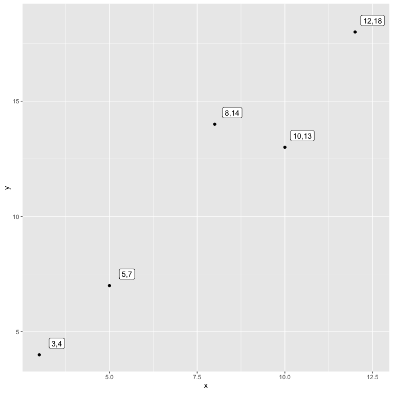
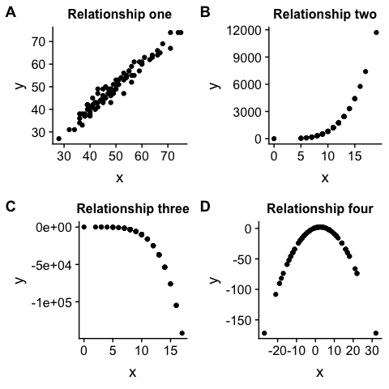

Correlation
================
Prof. Dr. Jan Kirenz

# Introduction

Correlation is a way of measuring the extent to which two variables are
related. This means we need to analyse whether as one variable
increases, the other

1)  increases,
2)  decreases or
3)  stays the same.

This can be done by calculating the covariance or correlation of two
variables.

We will use a small dataset to illustrate the concepts of covariance and
correlation: Let’s imagine we obtained purchase data from 5 different
people. In particular, we collected information about how often they
purchased products from company `x` and company `y` in the last month.

| x  | y  |
| :-: | :-: |
| 3  | 4  |
| 5  | 7  |
| 8  | 14 |
| 10 | 13 |
| 12 | 18 |

*Notational conventions*:

  - *n* represents the number of distinct data points, or observations,
    in our sample.

  - *p* denotes the number of variables that are available in the
    dataset.

  - \(x_{ij}\) represents the value of the j*th* variable for the i*th*
    observation, where i = 1, 2, . . ., n and j = 1, 2, . . . , p.

-----

# Visual inspections with scatterplots

When we analyse the relationship between two variables, one of the most
useful techniques for gaining a first insight into this relationship is
a scatterplot. Check the illustration of the two variables to get an
idea of the kind of relationship between them:

``` r
coords = paste(df$x,df$y,sep=",")
ggplot(df) +
  geom_point(aes(x,y)) +
  geom_label(aes(x+.5,y+0.5,label=coords))
```

<!-- -->

In this scatterplot, each person in the dataset is represented by a
point in two-dimensional space. The coordinates of this point
(\(x_{ij}\),\(y_{ij}\)) are the individual’s scores on variables x and y
respectively.

To get more information about the usage of scatterplots, review the
chapter covariance in [Grolemund and Wickham
(2016)](https://r4ds.had.co.nz/exploratory-data-analysis.html#covariation)

-----

# Covariance

One way to quantify the relationship between two variables is to
calculate the *covariance*, which basically is a number that reflects
the degree to which two variables vary together.

Covariance is closely related to the *variance* (also referred to as
\(s^2\) or \(\sigma^2\)) of one variable. Remember, that the *variance*
for a single variable is computed as:

\[s^2 = \frac{1}{(n-1)} \sum_{i=1}^n (x_i - \bar{x})^2\]

The variance tells us how far the observations are spread out from their
average value. Let’s obtain the variance of variable x and y for our
example:

1)  calculate the mean,
2)  determine the deviation of every observation from the mean,
3)  calculate the square of the deviations,
4)  sum up the squared deviations,
5)  devide the sum of squared deviations by (n-1).

The results from step 1 to 3 are illustrated in this
table:

| x  | y  | x\_mean | y\_mean | x\_dev | y\_dev | x\_dev\_sq | y\_dev\_sq |
| :-: | :-: | :-----: | :-----: | :----: | :----: | :--------: | :--------: |
| 3  | 4  |   7.6   |  11.2   | \-4.6  | \-7.2  |   21.16    |   51.84    |
| 5  | 7  |   7.6   |  11.2   | \-2.6  | \-4.2  |    6.76    |   17.64    |
| 8  | 14 |   7.6   |  11.2   |  0.4   |  2.8   |    0.16    |    7.84    |
| 10 | 13 |   7.6   |  11.2   |  2.4   |  1.8   |    5.76    |    3.24    |
| 12 | 18 |   7.6   |  11.2   |  4.4   |  6.8   |   19.36    |   46.24    |

Now we are able to calculate the variance of both variables (step 4 and
5):

``` r
# compute the variance 
var_x <- (sum(df$x_dev_sq) / 4)
var_y <-  (sum(df$y_dev_sq) / 4)

sprintf("variance of x  = %.2f", var_x)
```

    ## [1] "variance of x  = 13.30"

``` r
sprintf("variance of y  = %.2f", var_y)
```

    ## [1] "variance of y  = 31.70"

In contrast to variance, the *covariance* (\(cov_{XY}\)) tells us
whether there is a relation between the deviations of *two* different
variables across observations. It is defined as:

\[
covariance = \frac{1}{(n-1)} \sum_{i=1}^n (x_i - \bar{x})(y_i - \bar{y})
\]

This value will be far from zero when x and y are both highly deviant
from the mean:

  - if they are deviant in the same direction then the covariance is
    positive, whereas

  - if they are deviant in opposite directions the covariance is
    negative.

To be able to determine the covariance, we first need to calculate the
crossproduct of `x_dev` and
`y_def`:

| x  | y  | x\_mean | y\_mean | x\_dev | y\_dev | x\_dev\_sq | y\_dev\_sq | crossproduct |
| :-: | :-: | :-----: | :-----: | :----: | :----: | :--------: | :--------: | :----------: |
| 3  | 4  |   7.6   |  11.2   | \-4.6  | \-7.2  |   21.16    |   51.84    |    33.12     |
| 5  | 7  |   7.6   |  11.2   | \-2.6  | \-4.2  |    6.76    |   17.64    |    10.92     |
| 8  | 14 |   7.6   |  11.2   |  0.4   |  2.8   |    0.16    |    7.84    |     1.12     |
| 10 | 13 |   7.6   |  11.2   |  2.4   |  1.8   |    5.76    |    3.24    |     4.32     |
| 12 | 18 |   7.6   |  11.2   |  4.4   |  6.8   |   19.36    |   46.24    |    29.92     |

Finally, we can determine the covariance:

``` r
# compute covariance
sprintf("sum of cross products = %.2f", sum(df$crossproduct))
```

    ## [1] "sum of cross products = 79.40"

``` r
covXY <- sum(df$crossproduct) / (nrow(df) - 1)
sprintf("covariance: %.2f", covXY)
```

    ## [1] "covariance: 19.85"

Note that we don’t usually use the covariance to describe relationships
between variables, because it strongly depends upon the standard
deviation of the variables. For example, a value of \(cov_{XY}=1\) might
reflect a high degree of correlation when the standard deviations are
very small, but a low degree of correlation when the standard deviations
are high (Howell, 2009). This makes the covariance hard to interpret.

-----

# Pearson’s correlation

Instead of calculating the *covariance*, we would usually use the
*correlation coefficient r* (often referred to as *Pearson’s correlation
coefficient r* after the statistician Karl Pearson) to describe linear
relationships between two numerical (at least intervall scaled)
variables. It is important to note that the correlation coefficient can
only assess linear relationships.

The correlation coefficent r is computed by standardising the covariance
by the standard deviations of the two variables (i.e. divide by the
standard deviations of both variables).

Remember that the standard deviation is simply the positive square root
of the variance:

``` r
# compute the variance 
sd_x <- sqrt(sum(df$x_dev_sq) / 4)
sd_y <-  sqrt(sum(df$y_dev_sq) / 4)

sprintf("standard deviation of x   = %.2f", sd_x)
```

    ## [1] "standard deviation of x   = 3.65"

``` r
sprintf("standard deviation of y  = %.2f", sd_y)
```

    ## [1] "standard deviation of y  = 5.63"

The correlation coefficient r is calculated as follows:

\[
r = \frac{covariance}{s_xs_y} = \frac{1}{(n-1)} \frac{\sum_{i=1}^n (x_i - \bar{x})(y_i - \bar{y})}{s_x s_y}
\]

``` r
# compute the correlation coefficient

corXY <- sum(df$crossproduct) / ((nrow(df) - 1) * sd(df$x) * sd(df$y))
corXY_per = round(corXY*100)
sprintf("correlation coefficient = %.2f", corXY)
```

    ## [1] "correlation coefficient = 0.97"

The correlation coefficient is much more useful than the covariance
because it only can vary between \(-1\) and 1. We interpret the
magnitude of the relationship according to Cohen (1992):

**No linear relationship (“horizontal”):**

  - r = 0 indicates no linear relationship.

**Positive linear relationship (“uphill”):**

  - 0 \< r ≤ 0.1 indicates a small positive linear relationship
  - 0.1 \< r ≤ 0.3 indicates a medium positive linear relationship
  - r = 1 indicates a perfect positive linear relationship

**Negative linear relationship (“downhill”):**

  - 0 \> r \> \(- 0.1\) indicates a medium negative linear relationship
  - \(- 0.1\) \< r ≥ \(- 0.3\) indicates a medium negative linear
    relationship
  - r = \(- 1\) indicates a perfect negative linear relationship

However, the r coefficient must be interpreted cautiously. Specifically,
r = 0.97 should not be interpreted to mean that there is a 97 % of a
relationship between the two variables. The correlation coefficient is
simply a point on the scale between \(-1\) and 1, and the closer it is
to either of those limits, the stronger is the relationship between the
two variables (Howell, 2009).

You should also be aware of the fact that a specific correlation value
could occur by chance even if there is no relationship. This is
especially true, if you have a small sample size. Therefore, we need a
second measure to investigate the statistical significance of the
relationship.

-----

# Hypothesis testing for correlations

We can test the null hypothesis that the correlation is zero by
converting a correlation value into a *t* statistic (the details are not
important here).

``` r
# perform correlation test on data
cor.test(df$x,df$y) 
```

    ## 
    ##  Pearson's product-moment correlation
    ## 
    ## data:  df$x and df$y
    ## t = 6.5458, df = 3, p-value = 0.007248
    ## alternative hypothesis: true correlation is not equal to 0
    ## 95 percent confidence interval:
    ##  0.5742408 0.9978860
    ## sample estimates:
    ##       cor 
    ## 0.9667297

The test shows that - under the assumption that the null hypothesis of r
= 0 is true - the likelihood of an r value this extreme or more is quite
low (review the *p-value*). Therefore, we would reject the null
hypothesis of \(r=0\).

-----

# 6\. Spearman’s correlation

One common problem with the standard correlation coefficient is that
this measure is very sensitive to outliers. For example, in the figure
below, we can see how a single outlying data point can cause a very high
positive correlation value, even when the actual relationship between
the other data points is perfectly
negative.


One way to address outliers is to compute the correlation on the *ranks*
of the data after ordering them, rather than on the data themselves;
this is known as *Spearman’s correlation*.

The Spearman correlation (also called Spearman’s rho or Spearman’s
\(\rho\) ) is a measure of rank correlation. In particular, it assesses
the statistical dependence between the rankings of two (at least ordinal
scaled) variables.

An important difference between the correlation coefficient r and
Spearman’s rho is that while Pearson’s correlation can only assess
linear relationships, Spearman’s rank correlation assesses *monotonic
relationships* (whether linear or not). A monotonic relationship between
two variables is a relationship where:

  - as the value of one variable increases, so does the value of the
    other variable (positive relationship), or

  - as the value of one variable increases, the other variable value
    decreases (negative relationship).

For our example dataset, the ranked data and the corresponding
Spearman’s rho is as
follows:

| x  | y  | x\_mean | y\_mean | x\_dev | y\_dev | x\_dev\_sq | y\_dev\_sq | crossproduct |
| :-: | :-: | :-----: | :-----: | :----: | :----: | :--------: | :--------: | :----------: |
| 3  | 4  |   7.6   |  11.2   | \-4.6  | \-7.2  |   21.16    |   51.84    |    33.12     |
| 5  | 7  |   7.6   |  11.2   | \-2.6  | \-4.2  |    6.76    |   17.64    |    10.92     |
| 8  | 14 |   7.6   |  11.2   |  0.4   |  2.8   |    0.16    |    7.84    |     1.12     |
| 10 | 13 |   7.6   |  11.2   |  2.4   |  1.8   |    5.76    |    3.24    |     4.32     |
| 12 | 18 |   7.6   |  11.2   |  4.4   |  6.8   |   19.36    |   46.24    |    29.92     |

Table continues below

| rank\_x | rank\_y |
| :-----: | :-----: |
|    1    |    1    |
|    2    |    2    |
|    3    |    4    |
|    4    |    3    |
|    5    |    5    |

``` r
cor.test(df$x, df$y, method = "spearman")
```

    ## 
    ##  Spearman's rank correlation rho
    ## 
    ## data:  df$x and df$y
    ## S = 2, p-value = 0.08333
    ## alternative hypothesis: true rho is not equal to 0
    ## sample estimates:
    ## rho 
    ## 0.9

In the case of the previous example with one outlier, the Spearman
correlation is -0.45 instead of r = 0.83, showing that the rank
correlation reduces the effect of the outlier:

``` r
cor(dfOutlier$x, dfOutlier$y, method = "spearman")
```

    ## [1] -0.4545455

-----

# Visualization of different relationships

``` r
par(mfrow=c(2,2))

# Relationship one
dfOne <-
  tibble(x = round(rnorm(n = 100, mean = 50, sd = 10))) %>%
  mutate(y = x + round(rnorm(n = 100, mean = 0, sd = 2)))

p1 <- ggplot(dfOne) +
  geom_point(aes(x,y)) +
  ggtitle("Relationship one") +
  theme(plot.title = element_text(size = 12)) 

# Relationship two
dfTwo <-
  tibble(x = round(rnorm(n = 100, mean = 10, sd = 3))) %>%
  mutate(y = 1  + 0.1*x^2 - 0.2*x^3 + 0.1*x^4)#  + round(rnorm(n = 100, mean = 0, sd = 2)))

p2 <- ggplot(dfTwo) +
  geom_point(aes(x,y)) +
  ggtitle("Relationship two") +
  theme(plot.title = element_text(size = 12)) 

# Relationship three

dfThree <-
  tibble(x = round(rnorm(n = 100, mean = 10, sd = 3))) %>%
  mutate(y = 100 - 0.2*x - 0.2*x^2 - 0.1*x^5) #+ round(rnorm(n = 100, mean = 5, sd = 10)))

p3 <- ggplot(dfThree) +
  geom_point(aes(x,y)) +
  ggtitle("Relationship three") +
  theme(plot.title = element_text(size = 12)) 

# Relationship four

dfFour <-
  tibble(x = round(rnorm(n = 100, mean = 0, sd = 10))) %>%
  mutate(y = 1 + 1*x - 0.2*x^2) #+ round(rnorm(n = 100, mean = 5, sd = 10)))

p4 <- ggplot(dfFour) +
  geom_point(aes(x,y)) +
  ggtitle("Relationship four") +
  theme(plot.title = element_text(size = 12)) 

plot_grid(p1, p2, p3, p4, labels = "AUTO")
```

<!-- -->

Please find below the correlation results (correlation coefficient r as
well as Sperman’s correlation) for the different relationships.

Correlation coefficient r for relationship one:

``` r
cor.test(dfOne$x, dfOne$y)
```

    ## 
    ##  Pearson's product-moment correlation
    ## 
    ## data:  dfOne$x and dfOne$y
    ## t = 45.079, df = 98, p-value < 2.2e-16
    ## alternative hypothesis: true correlation is not equal to 0
    ## 95 percent confidence interval:
    ##  0.9655443 0.9843079
    ## sample estimates:
    ##       cor 
    ## 0.9767259

Spearman’s \(\rho\) for relationship
    one:

``` r
cor.test(dfOne$x, dfOne$y, method="spearman")
```

    ## Warning in cor.test.default(dfOne$x, dfOne$y, method = "spearman"): Cannot
    ## compute exact p-value with ties

    ## 
    ##  Spearman's rank correlation rho
    ## 
    ## data:  dfOne$x and dfOne$y
    ## S = 5609.5, p-value < 2.2e-16
    ## alternative hypothesis: true rho is not equal to 0
    ## sample estimates:
    ##       rho 
    ## 0.9663397

Correlation coefficient r for relationship two:

``` r
cor.test(dfTwo$x, dfTwo$y)
```

    ## 
    ##  Pearson's product-moment correlation
    ## 
    ## data:  dfTwo$x and dfTwo$y
    ## t = 15.019, df = 98, p-value < 2.2e-16
    ## alternative hypothesis: true correlation is not equal to 0
    ## 95 percent confidence interval:
    ##  0.7637774 0.8860473
    ## sample estimates:
    ##       cor 
    ## 0.8349383

Spearman’s \(\rho\) for relationship
    two:

``` r
cor.test(dfTwo$x, dfTwo$y, method="spearman")
```

    ## Warning in cor.test.default(dfTwo$x, dfTwo$y, method = "spearman"): Cannot
    ## compute exact p-value with ties

    ## 
    ##  Spearman's rank correlation rho
    ## 
    ## data:  dfTwo$x and dfTwo$y
    ## S = 0, p-value < 2.2e-16
    ## alternative hypothesis: true rho is not equal to 0
    ## sample estimates:
    ## rho 
    ##   1

Correlation coefficient r for relationship three:

``` r
cor.test(dfThree$x, dfThree$y)
```

    ## 
    ##  Pearson's product-moment correlation
    ## 
    ## data:  dfThree$x and dfThree$y
    ## t = -14.011, df = 98, p-value < 2.2e-16
    ## alternative hypothesis: true correlation is not equal to 0
    ## 95 percent confidence interval:
    ##  -0.8730701 -0.7388042
    ## sample estimates:
    ##        cor 
    ## -0.8167063

Spearman’s \(\rho\) for relationship
    three:

``` r
cor.test(dfThree$x, dfThree$y, method="spearman")
```

    ## Warning in cor.test.default(dfThree$x, dfThree$y, method = "spearman"):
    ## Cannot compute exact p-value with ties

    ## 
    ##  Spearman's rank correlation rho
    ## 
    ## data:  dfThree$x and dfThree$y
    ## S = 333300, p-value < 2.2e-16
    ## alternative hypothesis: true rho is not equal to 0
    ## sample estimates:
    ## rho 
    ##  -1

Correlation coefficient r for relationship four:

``` r
cor.test(dfFour$x, dfFour$y)
```

    ## 
    ##  Pearson's product-moment correlation
    ## 
    ## data:  dfFour$x and dfFour$y
    ## t = 2.0894, df = 98, p-value = 0.03926
    ## alternative hypothesis: true correlation is not equal to 0
    ## 95 percent confidence interval:
    ##  0.01051963 0.38722245
    ## sample estimates:
    ##      cor 
    ## 0.206511

Spearman’s \(\rho\) for relationship
    four:

``` r
cor.test(dfFour$x, dfFour$y, method="spearman")
```

    ## Warning in cor.test.default(dfFour$x, dfFour$y, method = "spearman"):
    ## Cannot compute exact p-value with ties

    ## 
    ##  Spearman's rank correlation rho
    ## 
    ## data:  dfFour$x and dfFour$y
    ## S = 119800, p-value = 0.004611
    ## alternative hypothesis: true rho is not equal to 0
    ## sample estimates:
    ##       rho 
    ## 0.2811024

# Literature

[Cohen, J. (1992). A power primer. Psychological bulletin, 112(1),
p. 155.](https://www.ime.usp.br/~abe/lista/pdfn45sGokvRe.pdf)

Howell, D. C. (2009). Statistical methods for psychology. Cengage
Learning.

[Poldrack, R. A. (2019). Statistical Thinking for the 21st Century
(Draft: 2019-04-06). GitHub](http://statsthinking21.org/)

[Wickham, H., & Grolemund, G. (2016). R for data science: import, tidy,
transform, visualize, and model data. O’Reilly Media,
Inc.](https://r4ds.had.co.nz)
